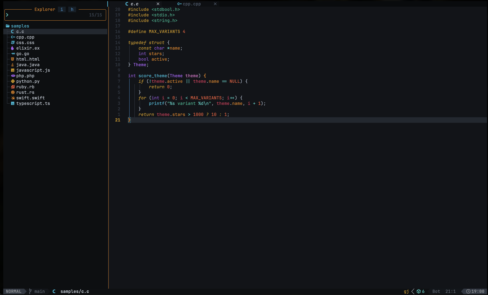
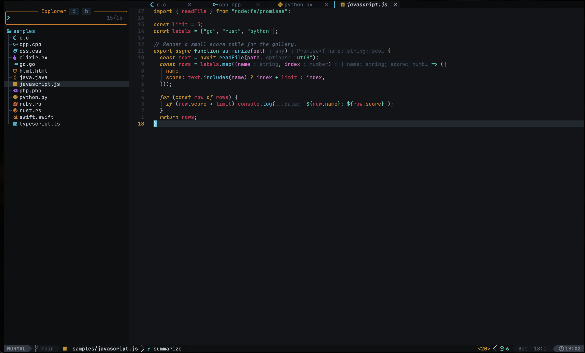

# solaris.nvim

A dark Neovim colorscheme inspired by [BeardedBear's Black & Gold](https://github.com/BeardedBear/bearded-theme) VS Code theme. Built on a near-black background with warm gold accents and a rich, carefully mapped syntax palette.

## Features

- Dark theme with a near-black background and warm gold accents
- Treesitter and LSP semantic token support
- 60+ plugin integrations (telescope, blink.cmp, neo-tree, flash, gitsigns, etc.)
- Lualine theme included
- Terminal colors
- Configurable transparency, italic styles, and dim inactive windows

## Preview

C: 



JavaScript:



## Installation

### [lazy.nvim](https://github.com/folke/lazy.nvim)

```lua
{
  "Tickloop/solaris.nvim",
  lazy = false,
  priority = 1000,
  opts = {},
}
```

## Configuration

```lua
require("solaris").setup({
  style = "gold",
  transparent = false,
  terminal_colors = true,
  styles = {
    comments = { italic = true },
    keywords = { italic = true },
    functions = {},
    variables = {},
    sidebars = "dark",       -- "dark", "transparent", or "normal"
    floats = "dark",
  },
  dim_inactive = false,
  lualine_bold = false,

  on_colors = function(colors)
    -- Override palette colors
  end,

  on_highlights = function(highlights, colors)
    -- Override highlight groups
  end,

  plugins = {
    all = true,
    -- Or selectively:
    -- telescope = true,
    -- gitsigns = true,
  },
})
```

## Palette

| Role       | Color     | Used for                         |
|------------|-----------|----------------------------------|
| blue       | `#11B7D4` | functions                        |
| green      | `#00a884` | strings                          |
| yellow     | `#c7910c` | keywords, titles                 |
| purple     | `#a85ff1` | types, constructors              |
| orange     | `#d4770c` | accessors, properties, imports   |
| pink       | `#d46ec0` | decorators, parameters           |
| red        | `#E35535` | constants, booleans, numbers     |
| turquoize  | `#38c7bd` | storage keywords, operators      |
| salmon     | `#c62f52` | variables                        |

## Acknowledgements

- Color palette from [BeardedBear/bearded-theme](https://github.com/BeardedBear/bearded-theme)
- Plugin architecture adapted from [folke/tokyonight.nvim](https://github.com/folke/tokyonight.nvim)

## License

[MIT](LICENSE)
